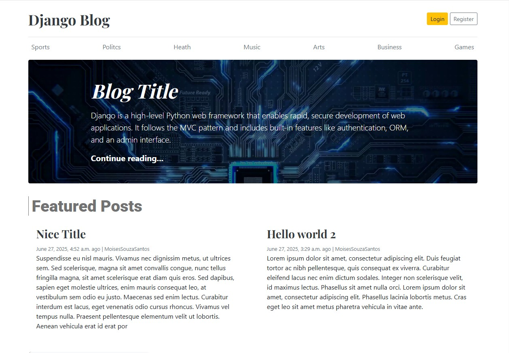
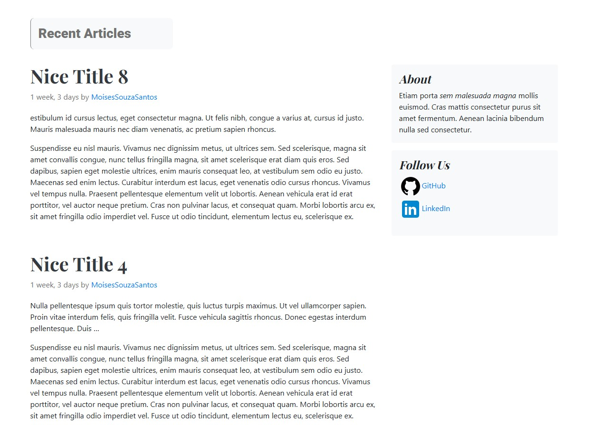
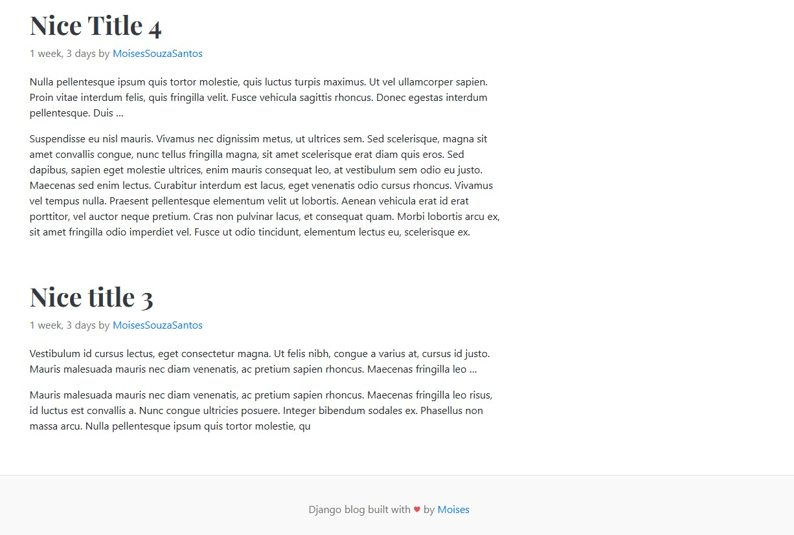
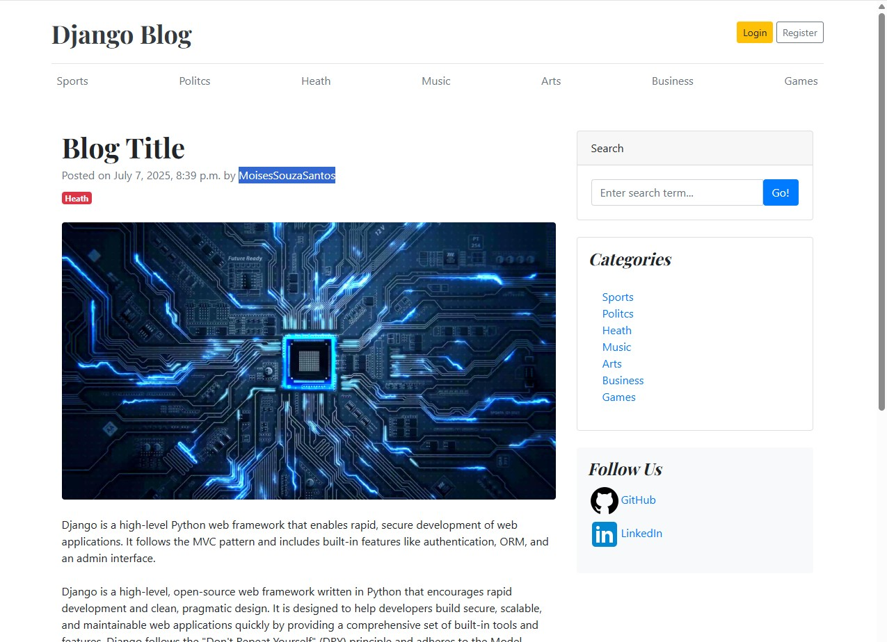
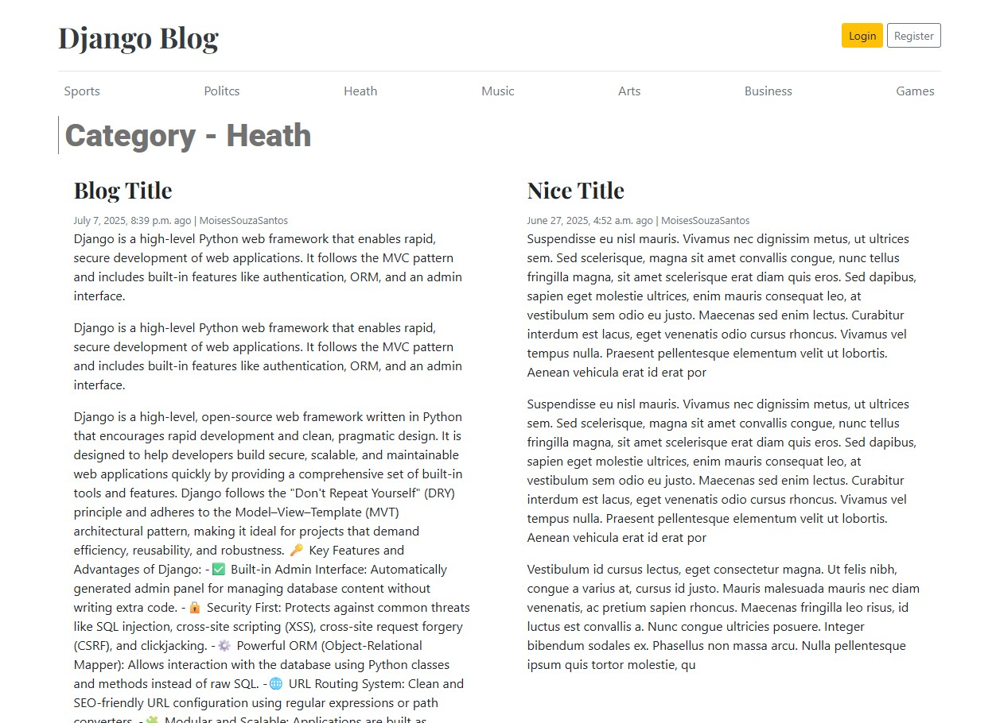
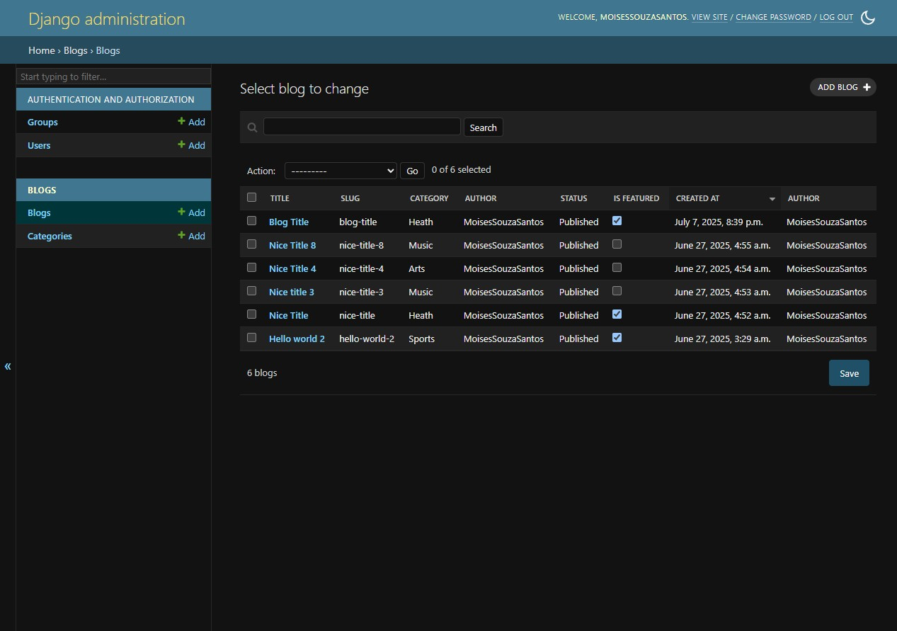

# 📰 Blog News – Django Full-Stack Web Application

[](https://www.djangoproject.com/)
[](LICENSE)

> 🇧🇷 Projeto completo de blog de notícias desenvolvido com Django.  
> 🇺🇸 Full-featured news blog project built with Django.

---

# 📰 Blog News Project

> 🇧🇷 Projeto completo de blog de notícias com Django.  
> 🇺🇸 Full-featured news blog project built with Django.

---

## 📌 Funcionalidades | Features

**🇧🇷 Em português:**
- Cadastro, login e logout de usuários
- Criação, edição e exclusão de postagens (CRUD)
- Sistema de categorias para organizar os posts
- Interface responsiva com templates customizados
- Painel administrativo do Django

**🇺🇸 In English:**
- User registration, login and logout
- Create, edit and delete blog posts (CRUD)
- Post categorization system
- Responsive interface with custom templates
- Django admin dashboard

---

## 🛠️ Tecnologias | Technologies

- **Python** & **Django** – Backend framework
- **HTML5**, **CSS3** – Frontend structure and styling
- **Bootstrap** *(or similar)* – Responsive UI components
- **SQLite** – Default Django database (can be changed)

---

## 🚀 Como rodar o projeto | How to run the project

```bash
# 1. Clone o repositório / Clone the repository
git clone https://github.com/LinuxEater/blog-news-project.git
cd blog-news-project

# 2. Crie e ative o ambiente virtual / Create and activate virtualenv
python -m venv venv
source venv/bin/activate      # Linux/macOS
venv\Scripts\activate         # Windows

# 3. Instale as dependências / Install dependencies
pip install -r requirements.txt

# 4. Execute as migrações / Run migrations
python manage.py migrate

# 5. (Opcional) Crie um superusuário / Create a superuser
python manage.py createsuperuser

# 6. Inicie o servidor / Start development server
python manage.py runserver
```

- Acesse / Access:
  - 🌐 http://localhost:8000
  - 🔒 http://localhost:8000/admin

---

## 📁 Estrutura | Project structure

```
blog-news-project/
├── blog/                 # App principal / Main app
├── static/               # Arquivos estáticos / Static files
├── templates/            # Templates HTML
├── blog_news/            # Configuração Django / Django settings
├── manage.py             # Script de gerenciamento
└── requirements.txt      # Dependências / Requirements
```

---

## 📷 Capturas de Tela | Screenshots

### 🏠 Página Inicial do Blog | Blog Homepage

  
  


---

### 📄 Página de Post Individual | Single Blog Post Page



---

### 🗂️ Sistema de Categorias | Categories System



---

### 🔐 Painel Administrativo | Django Admin Panel

  


---

## 🙋‍♂️ Autor | Author

**Moisés Souza (LinuxEater)**  
💼 [GitHub](https://github.com/LinuxEater)  
📧 moisessouzasantos001@gmail.com  
📱 [WhatsApp](https://wa.me/5538998189765)

---

## 🤝 Contribuições | Contributions

**🇧🇷** Sinta-se livre para abrir *issues*, sugerir melhorias ou enviar *pull requests*.  
**🇺🇸** Feel free to open issues, suggest improvements, or submit pull requests.

---
